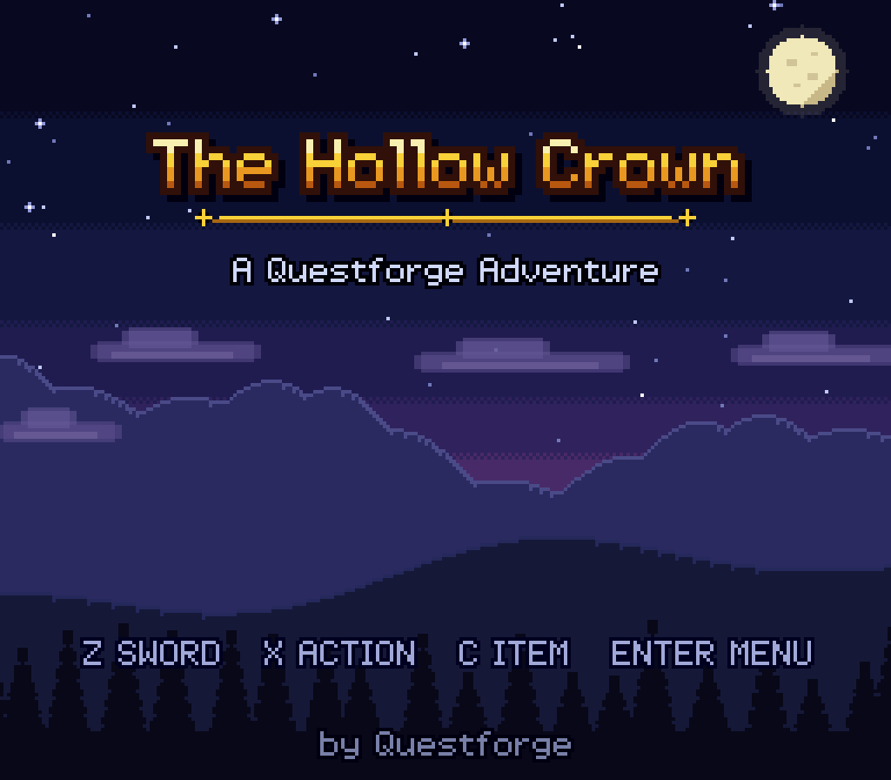
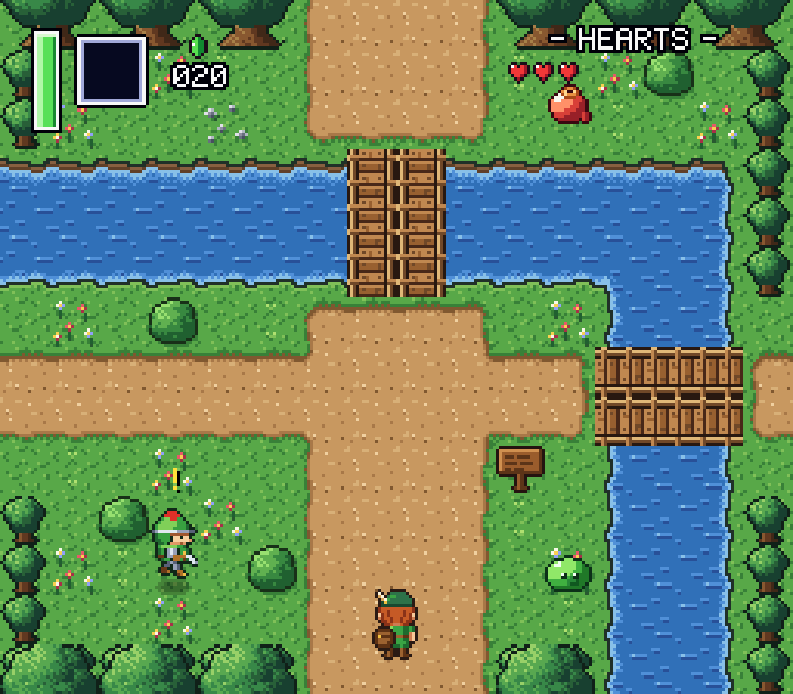
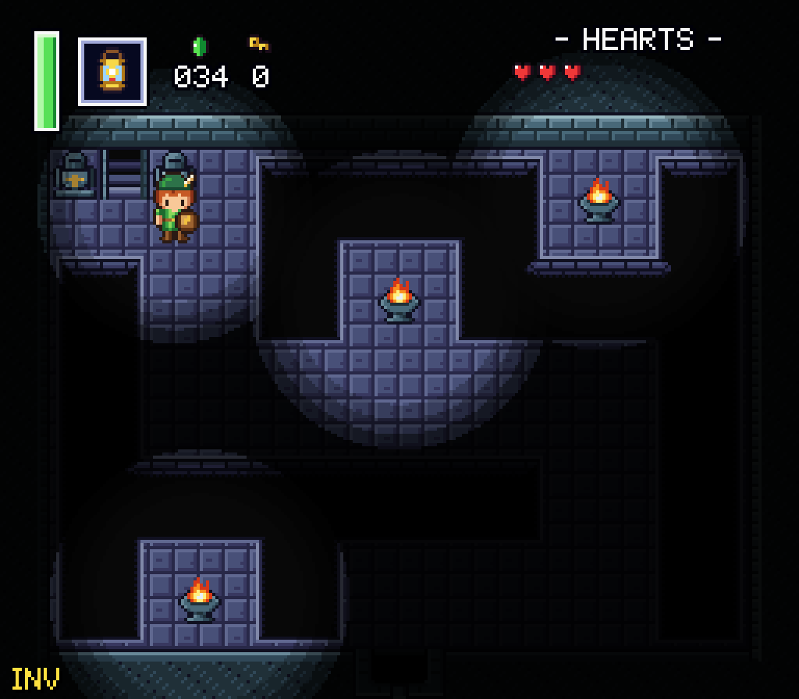
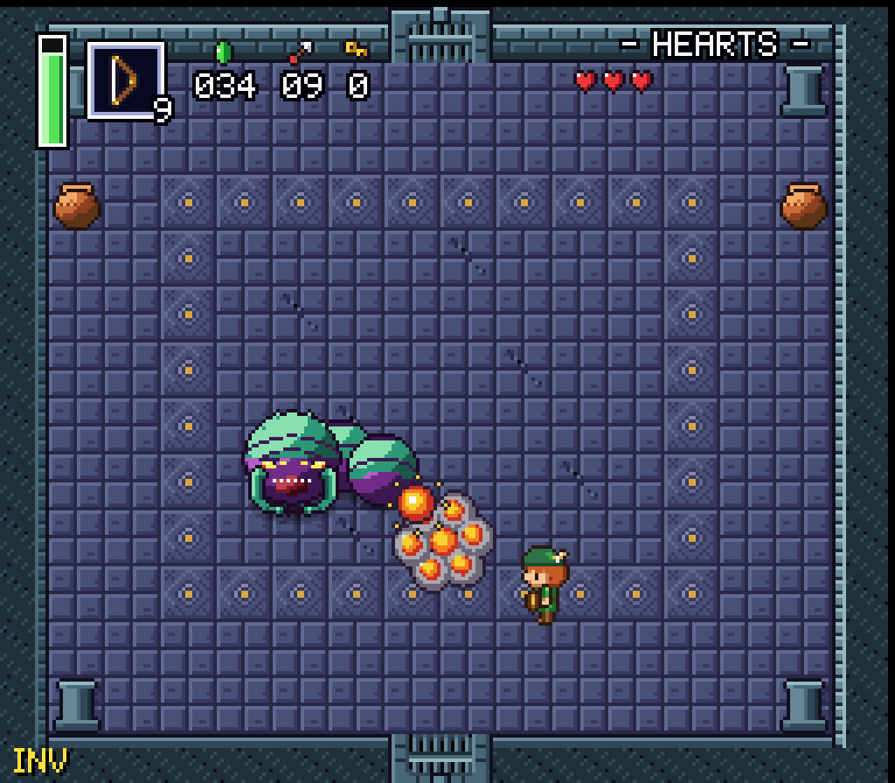
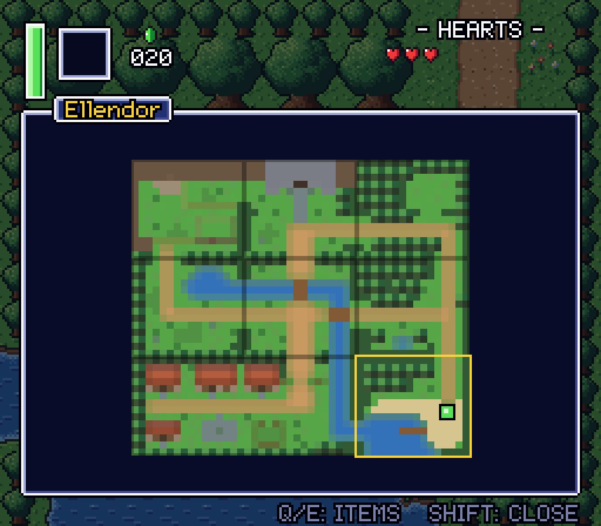
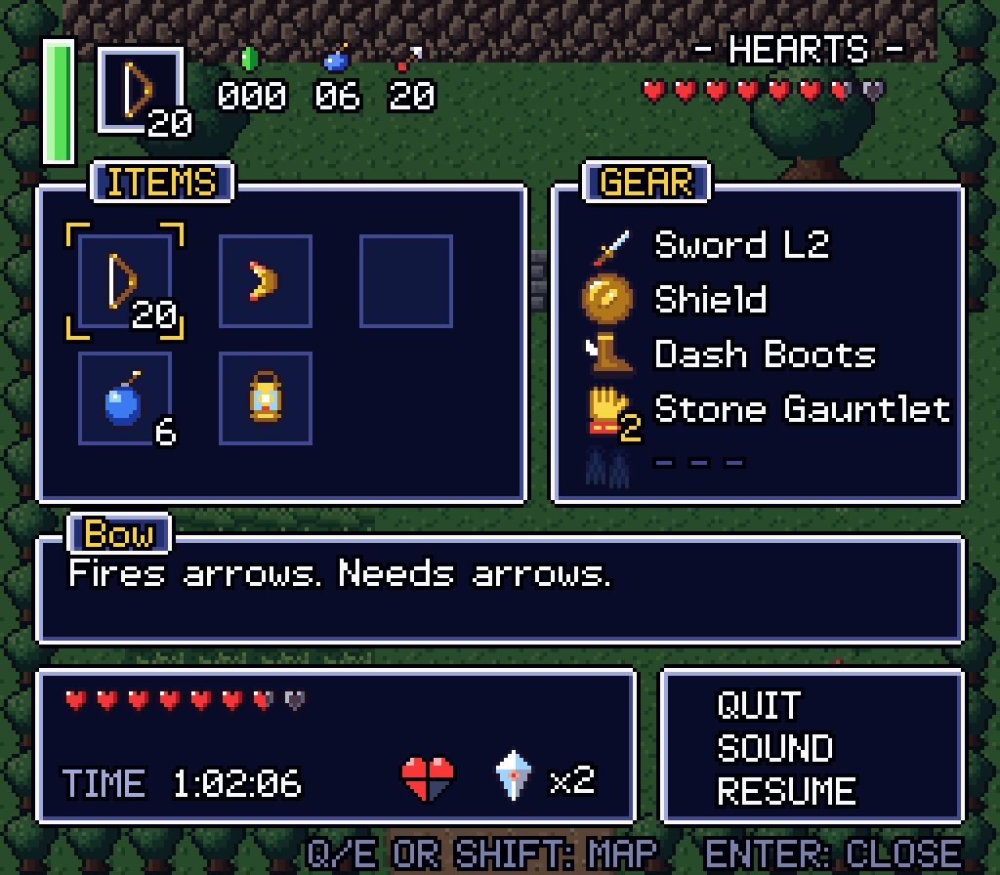
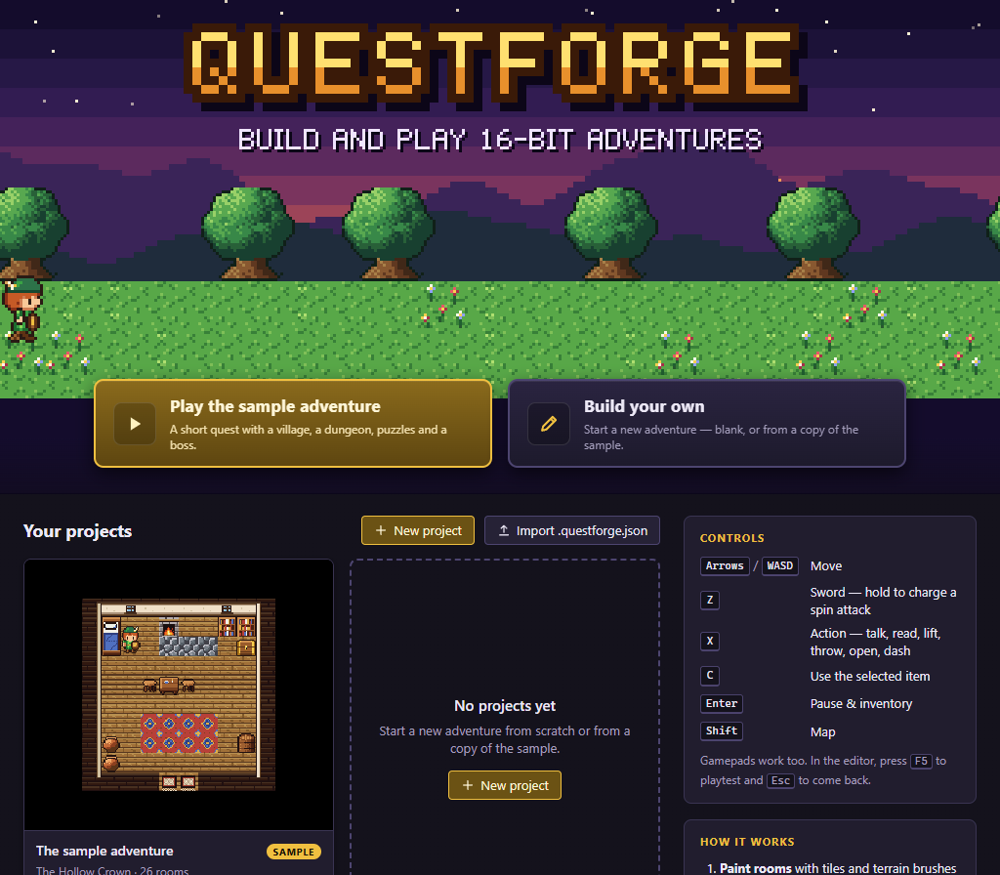
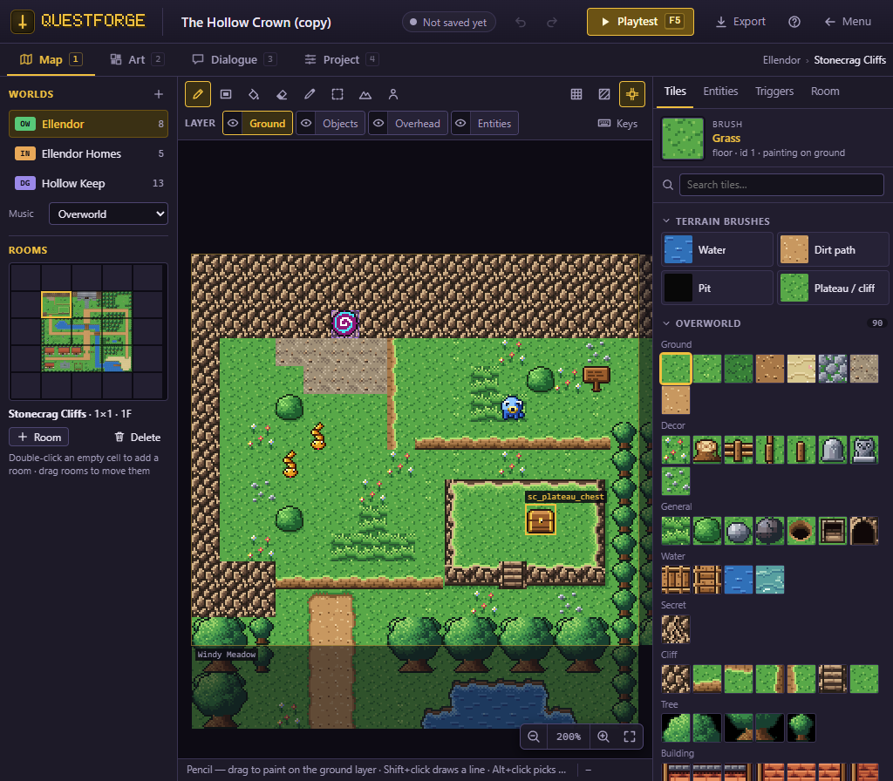
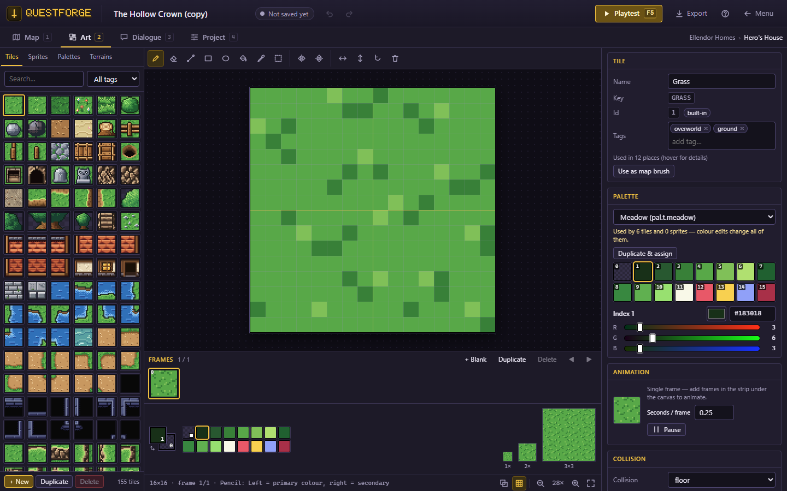
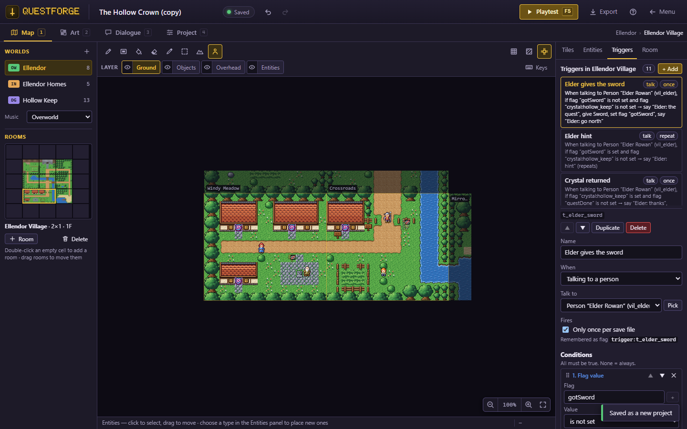

# Questforge

**▶ Play it in your browser: https://lawsonmode.github.io/questforge/**

> **A fan-made tribute.** Questforge was inspired by *The Legend of Zelda: A Link to the Past* and is
> an independent fan project with **no ties to Nintendo or The Legend of Zelda series**. If you enjoy
> it, go play the originals! (See [Inspiration and disclaimer](#inspiration-and-disclaimer).)

**Questforge** is a browser-based **16-bit top-down action-adventure maker and player**, directly
inspired by ***The Legend of Zelda: A Link to the Past***. One app, two halves:

- **The game**: sword and shield, a full item kit, a dozen enemies, bosses, dungeons with keys and
  puzzles, SNES-style 256×224 pixel rendering and an original chiptune soundtrack.
- **The builder**: a map and room editor, entity and puzzle placement, a trigger (event) editor, a
  dialogue editor, a pixel-art editor and one-key playtesting.

It ships with a complete sample adventure, **"The Hollow Crown"**: a village, a valley of forests and
cliffs, secret caves, and the two-floor Hollow Keep with its bosses.

TypeScript + Vite, Canvas 2D and WebAudio, **no runtime dependencies**. Projects live in the browser
(IndexedDB) and export to a single `.questforge.json` file you can share.



| | |
|---|---|
|  |  |
|  |  |
|  | *Screenshots come from the automated e2e playthroughs; the small "INV" in the corner is the test run's debug-invincibility marker, not part of the game.* |

## Features

### The game
- **Classic top-down action**: 8-way movement, sword swing with a charged **spin attack**, a shield that
  blocks small projectiles, knockback and invincibility frames, ledge hops, pits, deep water and
  swimming, tall grass, spikes and stairs.
- **Items**: Bow & arrows, Boomerang (two levels), Grapple Claw, Bombs, Lantern, Dash Boots, Stone
  Gauntlet (two levels, lift rocks and heavy rocks), Flippers, Sword upgrade, Magic Jars, Fairies,
  Gems (the currency), Hearts, **Heart Vessels** and **Heart Shards** (four make a new heart).
- **12 enemies** with their own behaviours: Soldier, Archer, Rock Spitter, Bat, Skeleton, Slime,
  Spear Goblin, Shell Beetle, Eye Statue, Snake, Blade Trap, Ghost.
- **2 bosses**: the Giant Worm and the Iron Knight, each dropping a Heart Vessel.
- **Dungeons**: small keys and locked doors, the big key and big chest, dungeon map and compass,
  shutter doors, bombable walls, dark rooms lit by the lantern and torches, and a crystal prize.
- **Puzzles & objects**: chests, signs, push blocks, floor switches, crystal switches with colour pegs,
  torches, liftable pots, rocks and bushes, shops, warps and stairs.
- **Game UI**: title screen, three save slots with a file-select screen, HUD (magic, equipped item,
  gems / bombs / arrows / keys, hearts), dialogue boxes with choices, pause and inventory, a world and
  dungeon map, game over / continue, a SOUND panel for music and effect volume, and a CONTROLS page.
- **Controller support**: play the whole game, from the title screen on, with a gamepad. Button
  names and glyphs follow the pad in use (Xbox, PlayStation, Nintendo), with rumble and a Swap A/B
  option. See [Controllers](#controllers).
- **Original chiptune audio**: a synthesizer with an original track for every area (title, overworld,
  village, forest, dungeon, cave, house, boss, victory, game over, file select) and sound effects.

### The builder
- **Menu hub**: play the sample, start a new project (blank or from a copy of the sample), open,
  duplicate, export, import and delete projects. The hub can be driven with a controller too.
- **Map editor**: worlds (overworld, dungeon, interior) made of rooms of 1–4 × 1–4 screens on a grid
  with floors, three tile layers (ground, objects, overhead), pencil / rectangle / fill / eraser /
  eyedropper / select tools, **terrain brushes** whose borders fit themselves, copy & paste, a world
  overview mini-map, a collision overlay and full undo / redo.
- **Entities & puzzles**: place any enemy, boss, NPC, object, pickup or marker from a palette and edit
  its properties in a schema-driven inspector (drops, chest contents, door kinds, dialogue, warp
  destinations picked straight on the map).
- **Trigger editor**: room-scoped rules — *when* (auto, on entering, on talking to someone), *if*
  (enemies cleared, switches, torches lit, flags, items, regions, bosses defeated, blocks pushed),
  *then* (open / close doors, show / hide entities, set flags, dialogue, give / take items, change
  tiles, sound, music, the secret jingle, warp, heal, screen shake, wait).
- **Dialogue editor**: pages, speakers, `{name}` for the hero's name, `{btn:a}`-style button codes that
  show the player's own keys or controller buttons, choices that set flags, and a live preview laid out
  exactly like the game's dialogue box.
- **Pixel-art editor**: 16-colour palettes (snapped to the SNES 5-bit colour gamut), tiles with
  collision and behaviour settings (cuttable, liftable, bombable, animated), sprites with frames,
  animations and an origin, drawing tools, and usage tracking.
- **Project tab**: title, subtitle, author, start hearts and items, intro dialogue, title music, the
  start location, a live **validation report** with jump-to buttons, and project statistics.
- **Playtest** any time with **F5** (Shift+F5 from the selected room) with debug toggles for hitboxes,
  invincibility and noclip; **Esc** returns to the editor (on a controller, hold **Start + Select**).

| | |
|---|---|
|  |  |
|  |  |

## Controls

| Keyboard | Controller | Action |
|---|---|---|
| Arrows / WASD | D-pad / left stick | Move |
| **Z** (or J) | Bottom face button | Sword — hold, then release, for a spin attack |
| **X** (or K, Space) | Right face button | Action — talk, read, open, lift, throw, dash (with the Dash Boots) |
| **C** (or L) | Left face button | Use the selected item |
| **Enter** | Start | Pause & inventory (pick an item, save, sound settings) |
| **Shift** (or M) | Select | Map |
| Q / E | L / R (shoulder buttons) | Flip the pause menu's pages: items, map, controls |
| Esc | Hold Start + Select (1 s) | Leave a playtest |

The controller buttons, by name for each kind of pad, are listed under [Controllers](#controllers).

In the editor: **F5** playtest, **Shift+F5** playtest from the selected room, **Ctrl+S** save,
**Ctrl+Z / Ctrl+Y** undo / redo, **1–4** switch tabs, **?** help. The menu hub and the playtest bar
have a sound on / off toggle.

## Controllers

Questforge works with any gamepad the browser reports with the **standard mapping** (Xbox,
PlayStation and Nintendo pads and most other USB or Bluetooth pads) in Chrome, Edge and Firefox.
Plug the pad in and **press any button**: browsers only show a pad to a page after one of its buttons
is pressed. A notice appears when a controller connects or disconnects.

**Buttons follow the SNES layout by position**, so the sword is always the bottom face button and
action the right one, whatever is printed on them. Every on-screen hint, the title screen, the pause
menu and dialogue text name the buttons of the pad in use in its own glyphs (Xbox, PlayStation and
Nintendo pads are recognised automatically; other pads show A / B / X / Y and Start / Select). Press
a key and the hints switch back to the keyboard.

| Game button | Position | Xbox | PlayStation | Nintendo | Keyboard |
|---|---|---|---|---|---|
| Sword | bottom | A | ✕ | B | Z |
| Action (and confirm in menus) | right | B | ○ | A | X |
| Item | left | X | □ | Y | C |
| *(unused)* | top | Y | △ | X | — |
| Pause & inventory | Start | Menu | Options | + | Enter |
| Map | Select | View | Create | − | Shift |
| Pause pages | L / R | LB / RB | L1 / R1 | L / R | Q / E |
| Move | D-pad or left stick | | | | Arrows / WASD |

- **Swap A/B**: prefer the bottom button for action and confirm (the modern layout)? Turn on
  **Swap** on the pause menu's CONTROLS page (press Start, then L), or pick **Swapped** under
  *Button layout* in the menu hub's controller banner. It swaps the bottom and right face buttons
  everywhere, in the game and the menus, and the hints follow.
- **Vibration**: the pad rumbles when you are hurt, when a bomb goes off and at big moments (pads that
  support it). Turn it off on the CONTROLS page or in the hub's controller banner. Both settings are
  kept per browser.
- **Menus**: the d-pad or stick moves (holding repeats), the action button or Start selects, the sword
  button goes back. In the menu hub, message pages and the gallery the d-pad or left stick moves the
  focus (a gold ring shows it), the action button or Start presses the button, the sword button
  closes a dialog or goes back, and the right stick scrolls.
- **Name entry**: pick letters with the d-pad and the action button, delete with the sword button,
  finish with Start.
- **Unplugged mid-game?** The game pauses with a CONTROLLER DISCONNECTED notice; plug it back in (or
  carry on with the keyboard) and press any button.
- **Leaving a playtest**: hold **Start + Select** together for a second (a LEAVING PLAYTEST bar fills
  up), or press Esc on the keyboard.
- **Sound**: browsers only start audio after a click or a key press, and a controller button does not
  count. If the title screen says *CLICK OR PRESS A KEY FOR SOUND*, click the page or press a key once.

The menu hub's Controls card and the editor's help list every control with a Keyboard and a
Controller column, drawn for the pad in use. The editor itself is built for the mouse and keyboard.

## Quick start

Requires Node.js 20.19+ (or 22.12+) and a modern desktop browser.

```sh
npm install
npm run dev        # http://localhost:5173
npm run build      # typecheck + static production build in dist/
npm run preview    # serve dist/ locally
```

`dist/` uses relative paths, so it can be hosted from any static web server or a sub-folder
(GitHub Pages works as is).

## Build your own adventure

Open the menu hub and choose **Build your own** (start blank or from a copy of the sample). Your
project is saved in the browser automatically as you edit.

1. **Worlds & rooms** (Map tab). A project has worlds: an *overworld*, *dungeons* and *interiors*
   (houses, caves). Each world is a grid of rooms; a room is 1–4 screens wide and tall (one screen is
   16×14 tiles). Walking off a room edge scrolls into the neighbouring room on the same floor; with no
   neighbour the edge is a wall. Dungeons can have several floors.
2. **Painting & terrain**. Pick a tile from the palette and paint the **Ground** layer (floors, water,
   walls), the **Objects** layer (bushes, rocks, furniture — its collision wins) and the **Overhead**
   layer (drawn above the hero: tree tops, arches). Tools: Pencil (P/B), Rectangle (R), Fill (F), Eraser
   (E), Eyedropper (I), Select (S) and the **Terrain brush** (T), which paints grass, water, cliffs and
   paths with borders that fit themselves. Toggle the grid (G) and the collision overlay (C).
3. **Entities & puzzles**. With the Entities tool (N), drop enemies, bosses, NPCs, chests, doors, blocks,
   switches, torches, pots, pickups, shop items, warps and regions. Select one to edit its properties.
   Doors with the same *Link* share their open state across rooms; warps and pits pick their
   destination straight on the map.
4. **Triggers**. Every room has a trigger list: choose *when* it runs, the conditions that must hold and
   a sequence of actions. Example: "when all enemies are cleared → open the shutter door, play the
   secret jingle".
5. **Dialogue** (Dialogue tab). Write conversations page by page, name the speaker, use `{name}` for the
   hero's name and add choices that set flags. Hook a dialogue to an NPC, a sign or a trigger action.
   To name a button, write a **button code** instead of a key: `{btn:a}` (action), `{btn:b}` (sword),
   `{btn:y}` (item), `{btn:start}` (pause menu), `{btn:select}` (map), `{btn:l}` / `{btn:r}` (pause
   pages) or `{btn:move}` (movement). The game shows each one as the player's own key or controller
   button: "Press `{btn:a}` to read" reads *Press X to read* on a keyboard, *Press B to read* on an Xbox
   pad and *Press ○ to read* on a PlayStation pad. **Insert button…** puts a code at the cursor, and the
   preview's **Buttons as** picker shows the page for the keyboard or any kind of pad. Codes work in
   speaker names, answers and a sign's own text too.
6. **Pixel art** (Art tab). Edit the palettes, draw your own tiles (and set their collision and behaviour)
   and sprites with animation frames. Your own tiles start at id 1000 and appear in the map palette.
7. **Playtest**. Press **F5** at any time; debug keys F1 hitboxes, F2 invincible, F3 noclip.
8. **Check & share** (Project tab). Set the title, starting hearts and items and the start location,
   fix anything the validation report lists, then **Export** a `.questforge.json` file. Anyone can
   **Import** it from the menu hub (button, or drop the file on the page) to play or remix it.

## Project file format

A project is one JSON document (`format: "questforge"`, `version: 1`), exported as
`<name>.questforge.json`. The full data model is `src/core/types.ts`; in short:

| Field | Contents |
|---|---|
| `settings` | Title, subtitle, start hearts, start items, intro dialogue, title music |
| `palettes` | 16-colour palettes (`#rrggbb`, index 0 transparent) |
| `tiles`, `terrains` | Tile definitions (pixels, palette, collision, cut / lift / bomb behaviour, animation frames) and autotile terrain sets |
| `sprites` | Sprite definitions: frames, named animations, origin |
| `worlds` | Worlds → rooms (grid position, size in screens, floor, `bg` / `fg` / `over` tile layers, entities, triggers, music, dark, pit target) |
| `dialogues`, `flags` | Dialogue pages and choices; documented story flags |
| `start` | Where a new game begins (world, room, x, y, facing) |

Default tiles use fixed ids (never renumbered); user tiles start at 1000. Imports are migrated and
sanitised (`src/core/validate.ts`: unknown fields dropped, sizes clamped, colours normalised) and
validated before use. Save games are stored per project in three slots.

## Architecture

See **[ARCHITECTURE.md](ARCHITECTURE.md)** for the build contract: units and geometry, the engine tick
and draw order, module ownership, the contract files, feel targets and routes. In brief: `src/core`
(data model, catalog, validation, storage), `src/content` (default tiles / sprites / items, procedural
original art, the sample adventure), `src/gfx`, `src/input`, `src/audio`, `src/game` (engine, player,
entities, triggers, in-game UI), `src/editor` (the builder) and `src/app` (menu hub, routes).

## Testing

```sh
npm run typecheck            # tsc for src and tests
npx vitest run               # unit tests (tests/*.test.ts)
node scripts/e2e.mjs --all   # end-to-end scenarios (e2e/*.mjs) in headless Chrome / Edge
node scripts/e2e.mjs smoke   # one scenario; screenshots and a report land in e2e-out/<scenario>/
```

The e2e harness starts a Vite dev server and drives an installed Chrome or Edge through
`playwright-core` (set `QF_BROWSER` to another Chromium-based browser if needed). Opt-in visual review
sheets render tiles, sprites and every sample room to PNG:
`QF_SHEETS=1 npx vitest run tests/tools/sheets.test.ts` (also `art-*-preview`, `art-tiles-scenes`,
`sample-render`), written to `e2e-out/`.

## Inspiration and disclaimer

**The inspiration.** Questforge exists because of ***The Legend of Zelda: A Link to the Past***
(Nintendo, SNES, 1991). That game is the direct inspiration for Questforge's look, feel and design: the
top-down 16-bit world, the sword-and-items adventuring, the dungeons full of keys and puzzles.

**No affiliation.** Questforge is a free, independent fan project. It has **no ties to, and is not
sponsored or endorsed by, Nintendo or anyone involved with The Legend of Zelda series**. *Nintendo*,
*The Legend of Zelda* and *A Link to the Past* are trademarks of Nintendo; they are named here only to
credit the inspiration.

**All original.** All art, music, sound effects, names and story in Questforge are original: drawn,
composed and written for this project, and generated from code in `src/content/art` and `src/audio`.
It contains no assets, music, text or code from any Nintendo game.

**Go play the originals!** If Questforge gives you even a little of that 16-bit adventure feeling,
play the real thing. The Legend of Zelda series is one of the best in gaming, from the 1986 original
through *A Link to the Past*, *Link's Awakening*, *Ocarina of Time*, *Breath of the Wild* and
*Tears of the Kingdom*. You can play *A Link to the Past* today in the Nintendo Switch Online SNES
library.
